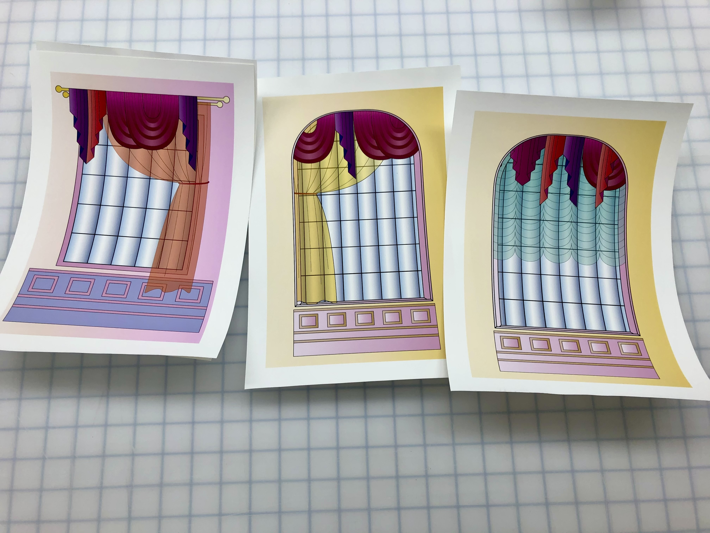
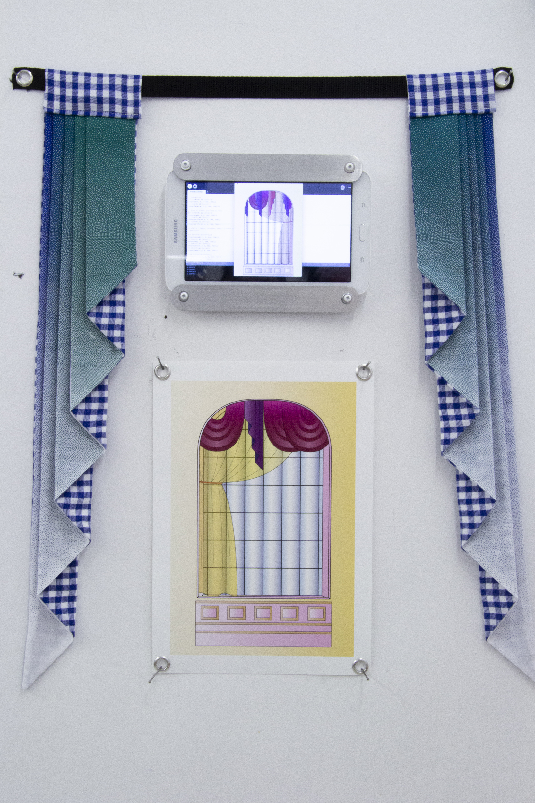

:::{.navbar}
[Matériel d'appui 01: Annexe](index.html) |
[Matériel d'appui 02: TheDecorator ](drapes.html) |
[Matériel d'appui 03: Générateurs d'effets de surface](motifs.html)
:::

# TheDecorator

TheDecorator est une application Processing qui permet de générer des drapés aléatoires servant de point de départ pour créer des sculptures textiles et des estampes numériques.

## Application Processing

Un nombre fini d'éléments de décoration ont été créés, puis combinés aléatoirement dans des compositions. À chaque fois qu'on clique dans la fenêtre, l'image est enregistrée en haute résolution et un nouveau décor est généré.


*TheDecorator, 2020, application Processing.*

## Estampes numériques et mise en espace

::: {layout-ncol=2}

:::

