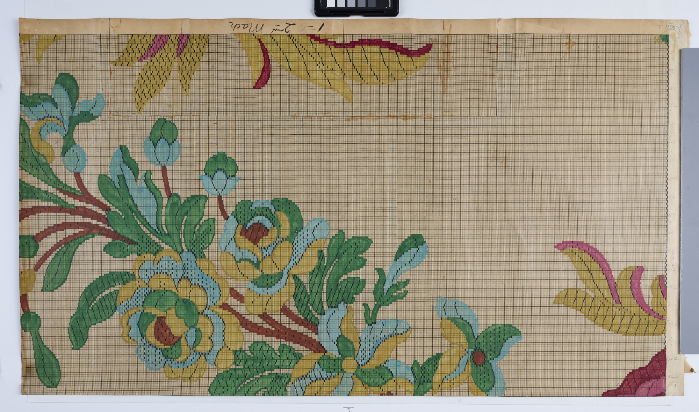
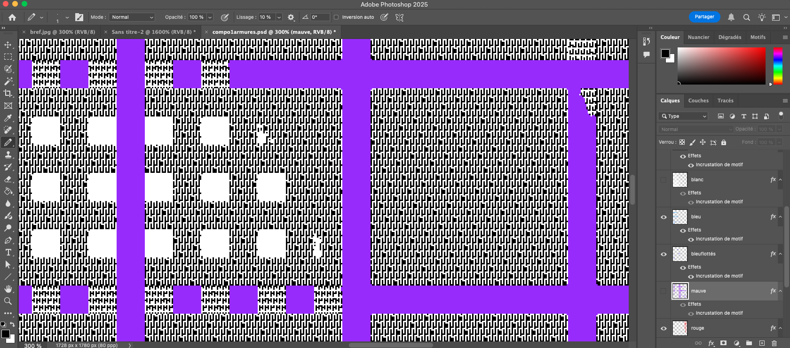
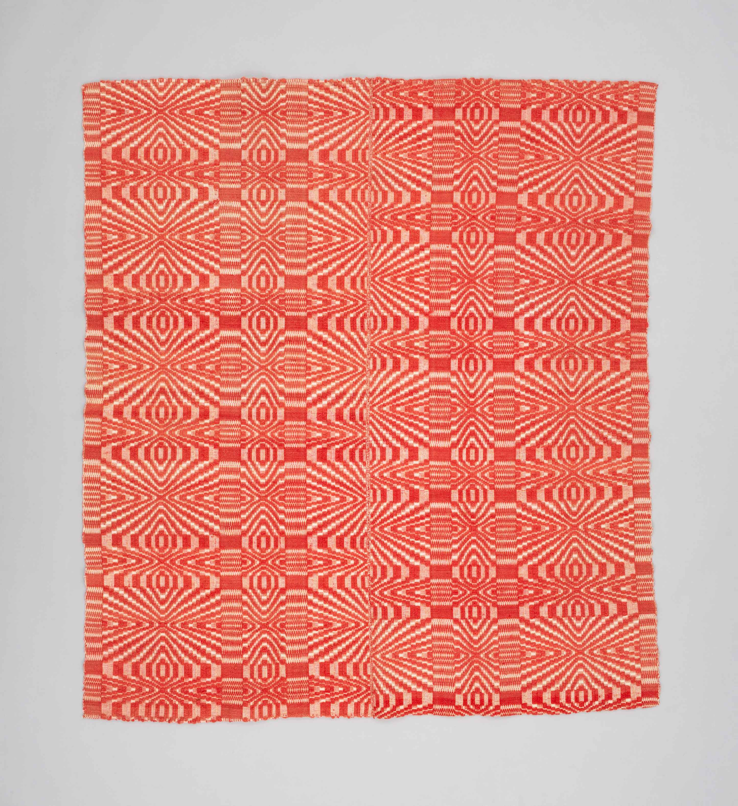
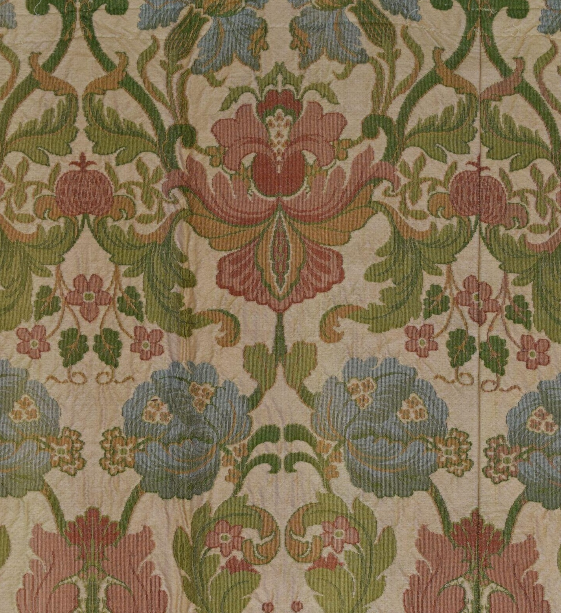
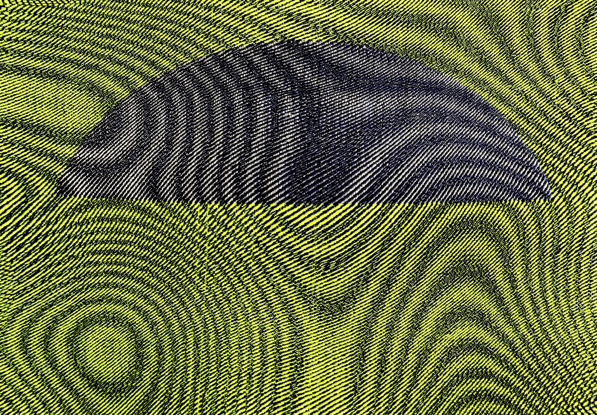
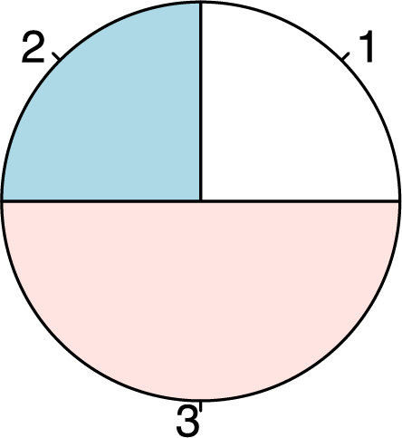
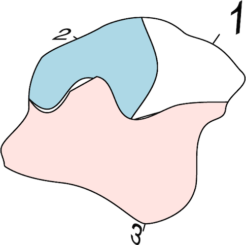

:::{.navbar}
[Matériel d'appui 01: Annexe](index.html) |
[Matériel d'appui 02: TheDecorator ](drapes.html) |
[Matériel d'appui 03: Générateurs d'effets de surface](motifs.html)
:::

# Annexe 1 : Tissage

## Annexe 1.1

*Processus de mise en carte*

Le Jacquard a été inventé pour faciliter la reproduction de designs complexes. Pour ce faire, les dessins étaient faits sur papier quadrillés, puis la structure associée à chaque couleur était ajoutée manuellement. Cette structure était ensuite transposée sur des cartes perforées. Aujourd'hui, on associe la structure à même les zones colorées d'une image matricielle et le métier Jacquard lit les pixels blancs et noirs au lieu des pleins et des vides des cartes perforées.



[Smithsonian National Museum of American History](https://americanhistory.si.edu/collections/object/nmah_644406){target="_blank"}

<br>



## Annexe 1.2

*Comparaison d'un tissage sur métier à cadres et d'un tissage sur métier Jacquard*

Le tissage sur métier à cadre se distingue par un nombre limité de couleurs, des motifs répétitif géométriques et une matérialité plus affirmée de la fibre. Le Jacquard est principalement utilisé comme médium de reproduction d'images dans le respect de l'original: grande palette de couleurs et fils aussi fin que possibles pour augmenter la résolution du tissage et diminuer l'effet de grille.

::: {layout-ncol=2}



:::

::: {layout-ncol=2}
[Textile Museum of Canada](https://collections.textilemuseum.ca/collection/6618/){target="_blank"}

[Victoria & Albert Museum](https://collections.vam.ac.uk/item/O270823/furnishing-fabric-unknown/){target="_blank"}
:::


## Annexe 1.3

Voici deux vidéos qui présentent des méthodes de génération algorithmique de fichiers prêts à tisser que j'ai mises au point. Ces approches visent à exploiter le langage formel du pixel pour créer des tissages en utilisant seulement les fonctions automatiques et aléatoires de Photoshop sans avoir d'image de départ.


### Mise en carte pour un tissage en armures doubles

Ce tissage à deux couches est basé sur la génération aléatoire d'un dégradé en diffusion. Il s'agit de la méthode qui a été utilisée pour réaliser la pièce WWW qu'on trouve dans le matériel d'appui (matériel d'appui no. 15, 16, 17).




### Mise en carte pour un tissage sergé

Ce tissage est basé sur la superposition de 2 sergés classiques qui, une fois déformés, engendrent un effet moiré dans la structure même du tissage.




### Tissage algorithmique

Génération algorithmique d'un original pour le tissage Jacquard basé sur un moiré en armures doubles.



# Annexe 2 : R

## Annexe 2.1

R peut générer une multitude de figures vectorielles, comme ce diagramme en pointe de tarte qu'on obtient à l'aide d'une simple commande. Celle-ci peut ensuite être exportée en .svg et retravaillée dans Illustrator. Cela dit, j'aimerais pouvoir contourner les graphiques classiques pour créer des figures aléatoires directement dans R. Pour ce faire, je dois investiguer les fonctions de base pour comprendre comment sont générés chacuns des éléments individuels (cercle, segments et leur positionnement, remplissage de couleur) et ensuite découvrir comment altérer ces formes.

::: {layout-ncol=2}




:::

## Annexe 2.2

Voici un exemple de création de dégradé et d'attribution au hasard des couleurs dans une matrice. Des explorations approfondies permettraient de créer des algorithmes de remplissage de la matrice plus intéressants.

*Choix de 3 couleurs au hasard*

```{r, fig.width=6, fig.height=2, fig.align='center'}
set.seed(6243518)
palette<-sample(colors(), size = 3)

par(mar = c(0, 0, 0, 0))

image(                              
  x = 1:4,   
  y = 1:2, 
  z = matrix(1:3, ncol = 1),                                   
  col = palette,
  axes = FALSE,
  xlab = "", 
  ylab = ""
)

```

*Création automatique d'un dégradé de 10 000 couleurs*

```{r, fig.width=6, fig.height=2, fig.align='center'}
library(RColorBrewer)

coul <- colorRampPalette(palette)(10000)

par(mar = c(0, 0, 0, 0))

image(                              
  x = 1:10001,   
  y = 1:2, 
  z = matrix(1:10000, ncol = 1),                                  
  col = coul,
  axes = FALSE,
  xlab = "", 
  ylab = ""
)

```

*Distribution aléatoire des 10 000 couleurs dans une matrice de 100 x 100*
```{r, fig.width=6, fig.height=6, fig.align='center'}
par(mar = c(0, 0, 0, 0))

image(                              
  x = 1:101,   
  y = 1:101, 
  z = matrix(sample(1:10000), ncol = 100),                                  
  col = coul,
  axes = FALSE,
  xlab = "", 
  ylab = ""
)
```

## Annexe 2.3

Dans le premier graphique, les courbes sont générées en fonction de la fréquence à laquelle on retrouve les valeurs dans le jeu de données. Dans le deuxième graphique, les courbes sont générées en fonction de coordonnées cartésiennes. Dans les deux cas, les courbes suivent l'axe des x. J'aimerais pouvoir contourner cette contrainte pour créer des formes basées sur des données numériques aléatoires. 

```{r, fig.width = 12, fig.align='center'}
library(ggplot2)

iris<-iris
par(mar=c(0,0,0,0))

hist<-ggplot(aes(x=Sepal.Length, fill = Species), data=iris) +
  geom_histogram(aes(y=after_stat(density)), binwidth = 0.1) + 
  geom_density(alpha=0.5)+
  facet_wrap(~Species)

hist

data_curve<-ggplot(aes(x=Sepal.Length, y= Sepal.Width, fill = Species, col = Species), data=iris) +
  geom_point(alpha =0.6) +
  geom_smooth(method = 'loess', formula = 'y~x', se =FALSE)+
  facet_wrap(~Species)

data_curve

```
